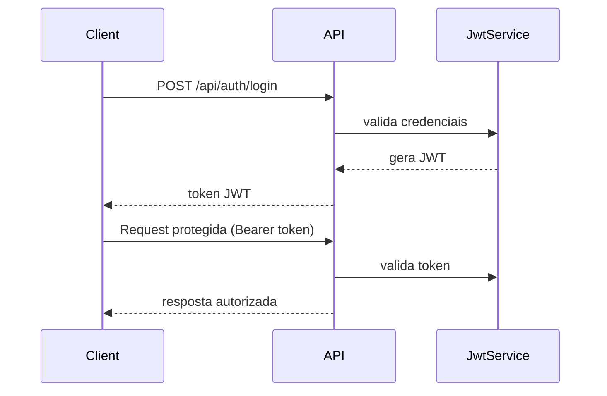
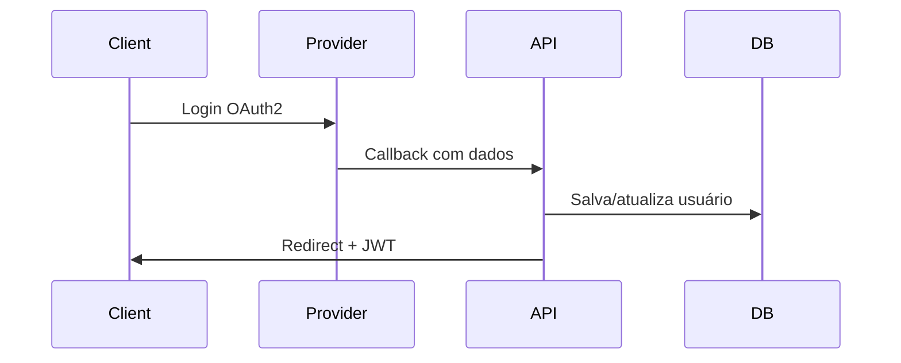
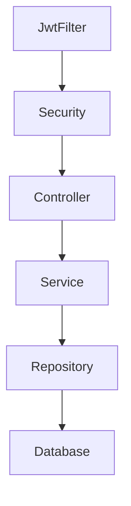
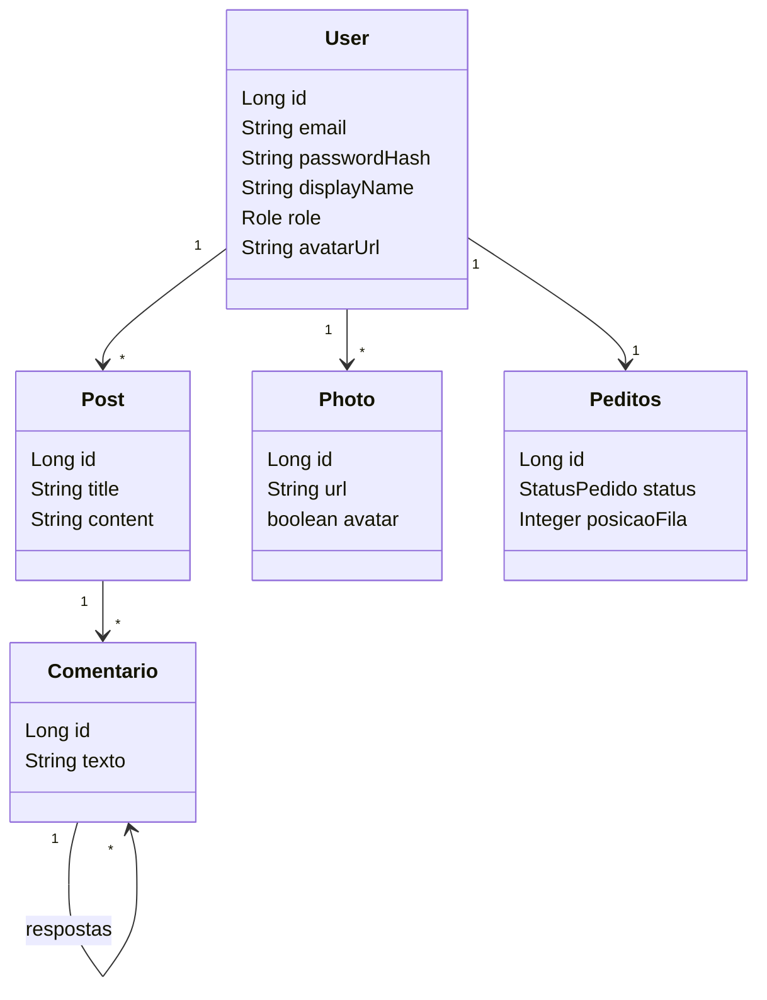

# 📘 Blog EU API

API backend desenvolvida em **Spring Boot** para um sistema de **blog + autenticação + pedidos (fila)**, com suporte a **JWT**, **OAuth2 (Google/GitHub)**, **upload de imagens**, **comentários encadeados**, **envio de e-mails** e **controle de fila de pedidos**.

---

## 🚀 Tecnologias Utilizadas

* Java 17+
* Spring Boot
* Spring Security (JWT + OAuth2)
* Spring Data JPA (Hibernate)
* Banco de dados relacional (MySQL / PostgreSQL / H2)
* Java Mail Sender
* Mermaid (diagramas)

---

## 📦 Funcionalidades Principais

### 🔐 Autenticação

* Registro de usuários
* Login com **JWT**
* Login social via **Google** e **GitHub**
* Controle de roles (`USER`, `ADMIN`, `MODERATOR`)

### 👤 Perfil do Usuário

* Buscar perfil autenticado
* Atualizar dados (nome, bio, localização, site)
* Upload de foto e avatar
* Remover foto

### 📝 Blog

* Criação de posts
* Comentários em posts
* Comentários com **respostas (threaded)**

### 📸 Mídia

* Upload de imagens
* Associação de fotos ao usuário
* Definição de avatar

### 📬 Email

* Envio de e-mails HTML
* Confirmação automática de pedidos

### 📊 Monitoramento

* Filtro global que contabiliza requisições HTTP

### 🧾 Sistema de Pedidos (Fila)

* Criar pedido
* Fila com posição automática
* Processamento sequencial
* Finalização e remoção do pedido
* Visualização da posição na fila

---

## 🔑 Autenticação – Fluxo JWT



---

## 🌐 OAuth2 – Google / GitHub



---

## 🧩 Arquitetura Geral



---

## 🧑‍💻 Entidades Principais



---

## 📡 Endpoints Principais

### 🔐 Auth

* `POST /api/auth/register`
* `POST /api/auth/login`
* `GET  /oauth2/success`

### 👤 Perfil

* `GET    /api/profile/me`
* `PUT    /api/profile/me`
* `POST   /api/profile/photo`
* `DELETE /api/profile/photo`

### 📝 Blog

* `GET /api/blog/posts`
* `POST /api/blog/posts`
* `POST /api/blog/comments`

### 🧾 Pedidos

* `POST /api/peditos/add`
* `GET  /api/peditos/meus`
* `GET  /api/peditos/position`
* `GET  /api/peditos/next (ADMIN)`
* `PUT  /api/peditos/finnality (ADMIN)`

---

## 🛡️ Segurança

* Stateless (JWT)
* Filtro personalizado `JwtAuthenticationFilter`
* Roles com `@PreAuthorize`
* OAuth2 integrado ao Spring Security

---

## ⚙️ Variáveis de Ambiente

```yaml
app:
  jwt:
    secret: BASE64_SECRET_KEY
    expires-in: 3600

  upload:
    dir: uploads/

  base-url: http://localhost:8080
```

---

## ▶️ Executando o Projeto

```bash
./mvnw spring-boot:run
```

---

## 📌 Observações

* Código organizado em camadas (Controller / Service / Repository)
* Preparado para frontend em **React / Next.js**
* Fácil extensão para novas roles e features

---

## 👨‍💻 Autor

**Luis**
Backend Developer • Spring Boot • Security • APIs REST

---

⭐ Se esse projeto te ajudou, deixa uma estrela!
